# Muraka - reef condition monitoring for the Maldives

Final-year project (UFCFXK-30-3 Digital Systems Project, Villa College / UWE
Bristol) by Ahmed Nauhaan Athif.

Reefs change faster than professional surveys can reach them. Divers photograph
those reefs every day, and that observation is currently lost. Muraka collects it:
contributors capture geotagged reef photographs in offline-first mobile apps, a
model grades each photograph patch by patch, and marine researchers confirm or
correct every result before it counts as data.

Five components, all self-hosted. **Nothing in the system depends on an external
API key.**

📚 The API contract and supporting reference material are in [`docs/`](docs/README.md).
🧪 Test results and requirement traceability are in [`TESTING.md`](TESTING.md).

---

## Quick start

**Docker is the only prerequisite.** Nothing else is needed to run the whole system -
no toolchain, no API key, no model download, no configuration file to edit.

```bash
git clone https://github.com/ihaveacrowuwu/DSP.git
cd DSP
make up                 # build and start everything (the first run builds images)
make seed N=2000        # load demo data
```

Then open **<http://localhost:5180>** and sign in as
`researcher@muraka.test` / `muraka-research-2026`.

That is the whole setup. Only the mobile apps need anything more.

To check the pipeline end to end:

```bash
make smoke              # 33 checks: register, submit, classify, verify
```

### What is running

| Service | URL | Notes |
|---|---|---|
| Dashboard | <http://localhost:5180> | The researcher and admin interface |
| API | <http://localhost:8090/healthz> | Go API, with the worker in-process |
| ML service | <http://localhost:8010/healthz> | Reports the model version it loaded |
| PostgreSQL | `localhost:5433` | user `muraka`, password `muraka`, database `muraka` |

Ports are overridable if they clash: `make up API_PORT=9090 WEB_PORT=5190`.

### Demo accounts

All created by `make seed`. All passwords are demo values.

| Email | Role | Password | Can see |
|---|---|---|---|
| `researcher@muraka.test` | researcher | `muraka-research-2026` | Map, review queue, records |
| `admin@muraka.test` | admin | `muraka-admin-2026` | The above, plus Operations |
| `diver@muraka.test` | contributor | `muraka-diver-2026` | The mobile apps |
| `diver2@muraka.test` | contributor | `muraka-diver-2026` | The mobile apps |

Contributors have no dashboard access; they use the mobile apps.

### Stopping and resetting

```bash
make down               # stop, keep the data
make reset-data N=2000  # wipe every sighting and reseed
make logs               # follow all logs
make ps                 # service status
```

`make down` keeps the PostgreSQL volume, so a later `make up` finds the same data.

---

## Screenshots

### Dashboard

| Reef map | Review queue |
|---|---|
| 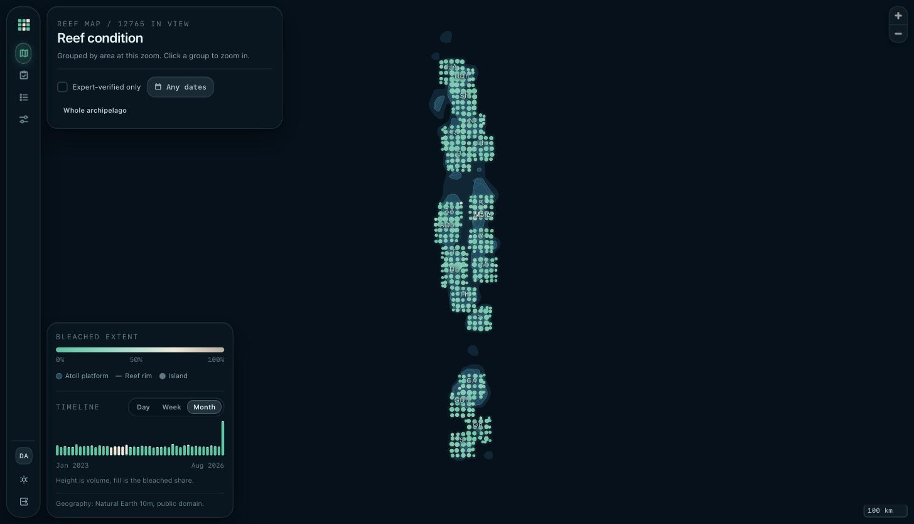 | 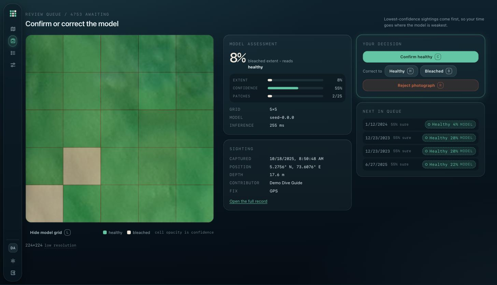 |
| Every sighting in the archipelago, grouped by area until you zoom in. | The patch lattice over the photograph, and the researcher's verdict. |

| Records | Operations |
|---|---|
| 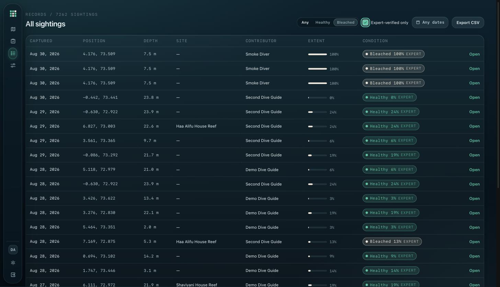 | 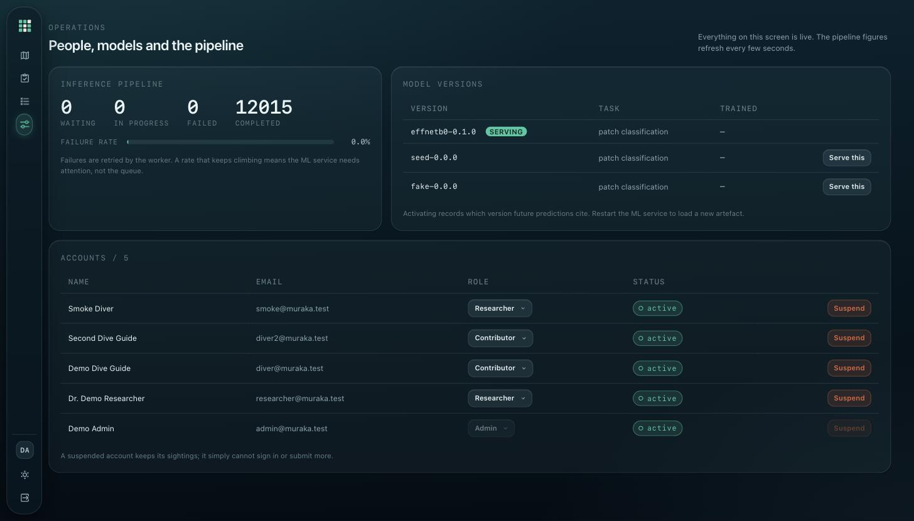 |
| Every sighting, filterable, exportable as CSV. Each badge says **MODEL** or **EXPERT**. | Queue depth, model versions and accounts. Admin only. |

### Mobile

The two contributor apps share the same six screens. The full set, including dark
mode, is in [`docs/evidence/mobile/`](docs/evidence/mobile/).

| Screen | Android | iOS |
|---|---|---|
| Sign in | 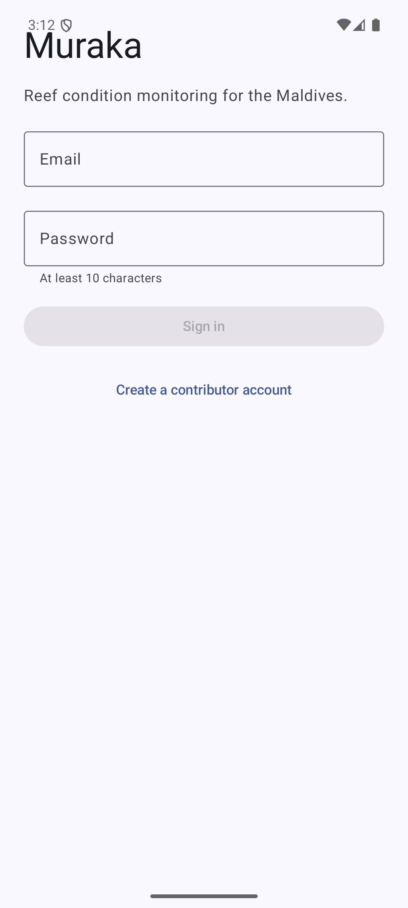 | 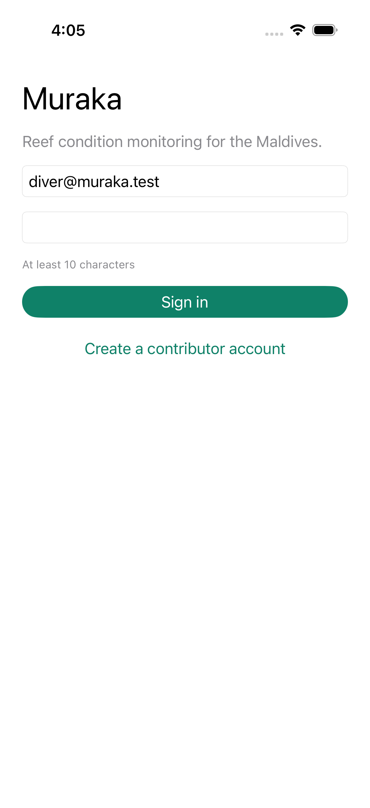 |
| My sightings | 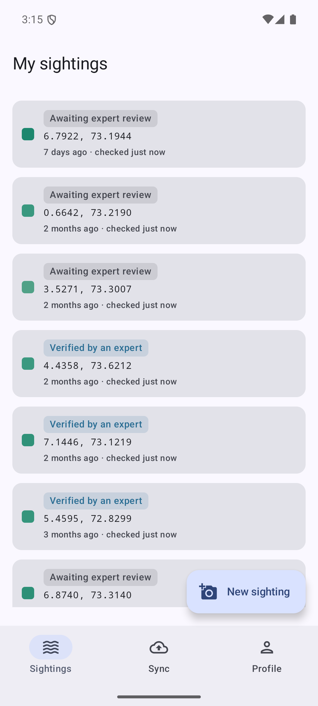 | 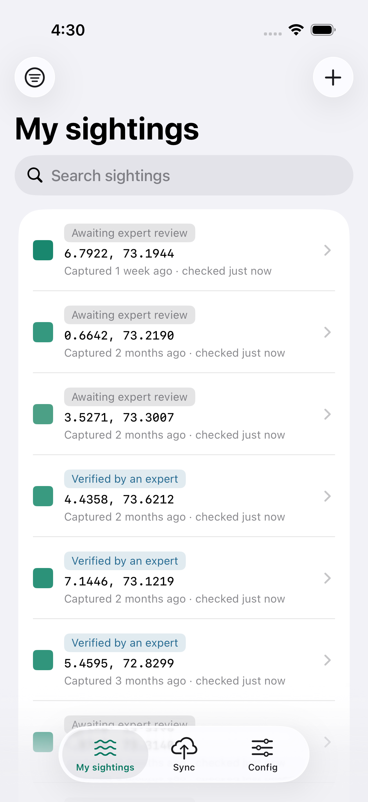 |
| Sighting detail | 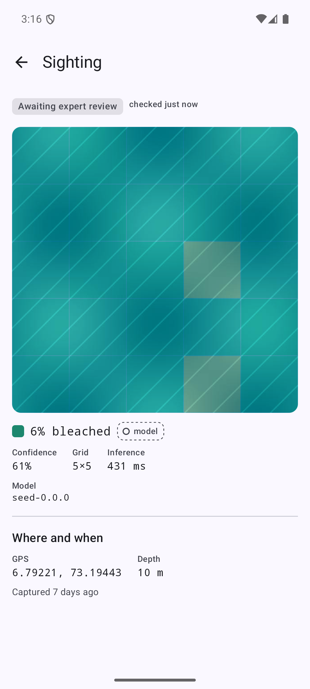 | 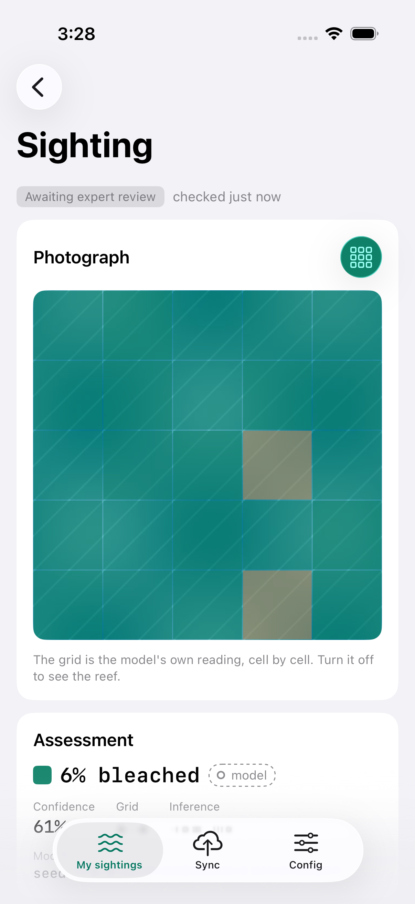 |
| Sync | 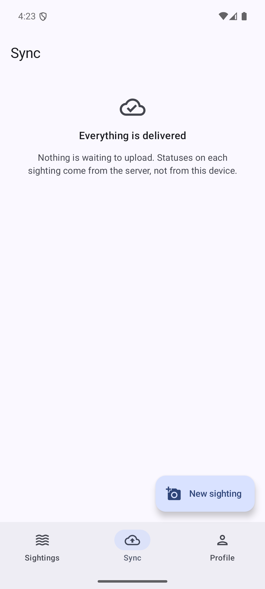 | 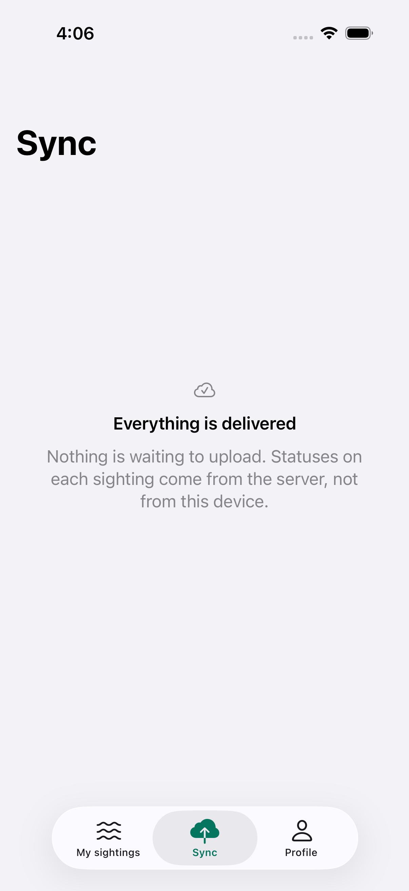 |

---

## Architecture

```
[Android app]──┐                                  ┌─[Python ML service]
 Kotlin/Compose│                                  │  FastAPI + ONNX, CPU only
               │ HTTPS/JSON                       │  patch-grid classification
[iOS app]──────┼────────► [Go API] ◄──internal────┘
 Swift/UIKit   │           │    │       HTTP
               │           │    └────────► image storage
[Vue dashboard]┘           ▼
 MapLibre           [PostgreSQL 16 + PostGIS]
                     single source of truth,
                     and the job queue
```

| Component | Stack |
|---|---|
| API + worker | Go 1.26, chi, pgx |
| ML service | Python 3.12, FastAPI, ONNX Runtime |
| Dashboard | Vue 3, TypeScript, MapLibre |
| Database | PostgreSQL 16 + PostGIS |
| Android app | Kotlin, Jetpack Compose, Material 3 |
| iOS app | Swift, UIKit, Liquid Glass |

### How a sighting flows through the system

1. A contributor captures photographs, a position and a depth. It works with no
   network at all and queues on the device.
2. On connectivity the app posts metadata, then each photograph. Both are
   idempotent on a **client-generated UUIDv7**, so a retry can never duplicate.
3. The API stores the record and enqueues a classification job in PostgreSQL.
4. A worker claims jobs with `FOR UPDATE SKIP LOCKED` and calls the ML service,
   which tiles the photograph into a grid, classifies each cell, and returns
   per-patch labels plus a **bleached-extent severity**.
5. The sighting becomes `awaiting_verification` and enters the researcher's queue,
   ordered by lowest model confidence first.
6. A researcher confirms, corrects or rejects it. Expert labels win; the model's
   prediction is preserved for provenance rather than overwritten.

---

## Running the mobile apps

Both apps need the stack running first (`make up && make seed N=200`), and both
sign in as `diver@muraka.test` / `muraka-diver-2026`.

Neither app needs an API key or a configuration file. The debug builds already
point at the local stack.

### Android

**Prerequisites**

- **JDK 21.** The build's toolchain is pinned to 21.
- **Android SDK with Platform 36.** Android Studio is optional - the SDK alone
  builds from the command line. If Android Studio has not written
  `android/local.properties`, copy `android/local.properties.example` to it and
  set `sdk.dir`.
- An emulator or a device on **API 26 (Android 8.0)** or newer.

Gradle 8.14.5 and AGP 8.13.2 come from the committed wrapper, so there is nothing
to install for those.

```bash
make android-install    # build and install on the running emulator or device
```

Or open the `android/` folder in Android Studio and press Run.

The debug build talks to `http://10.0.2.2:8090`, which is how an emulator reaches
the host. For a physical phone on the same Wi-Fi, pass your machine's address
instead:

```bash
cd android && ./gradlew installDebug -PmurakaApiBase=http://192.168.1.20:8090/
```

Cleartext HTTP is scoped to the debug build and to those hosts only. The release
build carries no such exception and points at HTTPS.

### iOS

**Prerequisites**

- **macOS with Xcode 26 or newer.** The app targets iOS 26 and uses Liquid Glass,
  so it needs the iOS 26 SDK.
- An **iOS 26 simulator runtime** (Xcode ▸ Settings ▸ Components).
- **XcodeGen** (`brew install xcodegen`). `Muraka.xcodeproj` is generated from
  `ios/project.yml` and is not committed, so generate it before first use.

```bash
cd ios && xcodegen generate && open Muraka.xcodeproj
```

Pick any iPhone simulator and press Run. The simulator shares the Mac's loopback,
so the debug build talks to `http://localhost:8090` with no extra configuration.

From the repository root, `make ios-build` and `make test-ios` do the same
generate-then-build without opening Xcode.

For a physical iPhone, copy `ios/Config/Local.xcconfig.example` to
`ios/Config/Local.xcconfig` and set your Mac's LAN address there. Cleartext HTTP is
confined to the debug configuration; the release build uses HTTPS only.

---

## Tests

```bash
make test        # Go, ML service and dashboard unit tests
make mobile      # Android and iOS unit tests
make smoke       # end-to-end pipeline check against the running stack
make lint        # linters and cross-platform contract checks
```

Suites that need infrastructure - a database, an emulator, a simulator - skip rather
than fail when it is absent.

The smoke test walks the whole pipeline: register, submit, upload, classify,
then verify as a researcher.

[`TESTING.md`](TESTING.md) records what each suite covers.

---

## Working on individual components

`make up` serves the dashboard as a static production build behind nginx. It does
not pick up source edits; rebuild with `make restart S=web`.

For frontend work, run the dev server instead and get hot module reload:

```bash
make dev-web            # hot reload on the same URL, :5180
make dev                # the same, plus starting postgres/api/ml first
```

`make dev-web` stops the static `web` container and serves the dev server on the
same port; `make up` puts the static container back.

The API and ML service can also run on the host against the containerised database:

```bash
make dev-api            # Go API on the host
make dev-ml             # ML service on the host, with reload
make psql               # a database shell
```

### TLS demo

An overlay serves the dashboard and the API from one origin over TLS.

```bash
make up-tls             # https://localhost:8443
make smoke-tls          # the same end-to-end check, through TLS
```

The certificate is self-signed and generated locally; a browser warns once. See
[`deploy/README.md`](deploy/README.md).

---

## Repository layout

```
backend/         Go API, worker, seed loader
ml/              service/ (inference), training/ (model training), models/ (the served ONNX)
web/             Vue dashboard
mobile-shared/   API contract notes, sync protocol, design tokens for the apps
android/  ios/   the two native contributor apps
deploy/          docker compose stack, TLS overlay
docs/            OpenAPI contract, screenshots and supporting material
scripts/         smoke test, performance harness, cross-platform contract checks
```

Each of `backend/`, `ml/`, `web/`, `android/`, `ios/` and `deploy/` has its own
README covering that component in depth.

### The bundled model

`ml/models/active.onnx` (15 MB) is the trained classifier; the ML service loads it
at startup. Set `FAKE_MODE=1` in `deploy/docker-compose.yml` to serve deterministic
stubs instead, which needs no model file.

---

## Design constraints

1. **The stack is fixed**: Go, Vue 3, Python for ML only, PostgreSQL + PostGIS.
   Android is Kotlin/Compose; iOS is Swift/UIKit.
2. **No external API keys.** No Mapbox, no Firebase, no cloud ML, no analytics.
   Local notifications instead of push, keyless map tiles, local models. The map's
   geography is committed under `web/public/basemap` (Natural Earth, public domain).
3. **Inference runs on CPU**, with no GPU at serving time.
4. **A model label is never presented as fact.** Model output and expert verdicts
   are visually distinct everywhere they appear, as the `MODEL` and `EXPERT` badges.

---

## Troubleshooting

| Symptom | Cause and fix |
|---|---|
| A port is already in use | Override it: `make up API_PORT=9090 WEB_PORT=5190 ML_PORT=8020 POSTGRES_PORT=5434` |
| Dashboard loads but shows no data | `make seed N=2000` has not been run yet |
| Dashboard edits do nothing | `make up` serves a static build. Use `make dev-web`, or `make restart S=web` |
| ML container restarting | `ml/models/active.onnx` is missing. Restore it, or set `FAKE_MODE=1` in `deploy/docker-compose.yml` |
| Map shows a blank square under the patch grid | Expected. A fresh clone has no reef imagery, so the seeder uses a plain swatch - see [`ml/README.md`](ml/README.md) to add real photographs |
| Go integration tests all skip | They need PostgreSQL. `make up` first |
| `make smoke` cannot connect | The stack is not running, or the API port was overridden - pass `MURAKA_API=http://localhost:9090` |
| iOS build fails: no such project | `Muraka.xcodeproj` is generated. Run `cd ios && xcodegen generate` |
| Android build fails on the JDK | The toolchain requires JDK 21 |

---

## Licence

Apache License 2.0 - see [`LICENSE`](LICENSE).
