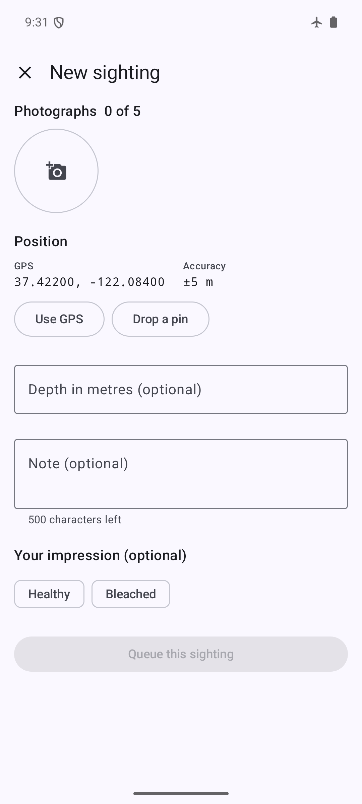

# Mobile acceptance checklist - results

The checklist at the end of [`mobile-shared/README.md`](../../../mobile-shared/README.md)
is the apps' stated definition of done. Every item was unticked until 2026-08-21, and
the offline half had never been walked at all.

This records what is now **automated**, what was **measured**, and what is still open -
including one risk that is neither a pass nor a defect. An acceptance checklist that
quietly marks itself done is worth less than one with a gap in it.

## Summary

| Item | Status | Evidence |
|---|---|---|
| Capture completes with the device in airplane mode | ✅ automated **and walked** | `capturingWithNoNetworkQueuesTheSightingAndKeepsThePhotograph`, plus the walkthrough below |
| Queued sightings survive a force-quit and a device restart | ✅ automated | `theQueueSurvivesTheProcessDying` |
| Sync resumes automatically when connectivity returns | ✅ automated | `theQueueDrainsOnceTheNetworkReturns` |
| Killing the app mid-upload does not duplicate or lose | ✅ automated | `aConnectionLostMidUploadResumesWithoutResendingWhatArrived` |
| Submitting the same sighting twice creates one record | ✅ automated | `drainingTwiceCreatesOneRecordAndUploadsNothingTheSecondTime`, and server-side `TestReplayingASubmissionCreatesExactlyOneRow` |
| A 401 mid-session refreshes silently | ◐ partial | `TokenAuthenticator` is exercised end-to-end by the iOS `APIClientIntegrationTests` and by `make smoke`; no Android-side test |
| Expired refresh token returns to sign-in without losing the queue | ✅ automated | `signingOutLeavesTheQueueUntouchedRatherThanUploadingOrDiscardingIt` |
| Model labels and expert verdicts distinguishable without colour | ✅ automated | the dashboard's NFR13 tests, incl. `is distinguishable with every colour class stripped`; both apps carry it in shape and word |
| Capture flow under 60 seconds and 8 taps | ◐ **taps counted, time not measured** | see below |
| Light and dark appearance both correct | ✅ automated | `testTheAppearanceToggleDarkensEveryScreen`, `testTheAppearanceChoiceIsRemembered`; Android night resources via `aapt2 dump` |
| Account deletion explains anonymisation | ✅ automated (server) | `TestDeletingAnAccountKeepsTheScienceAndDropsThePerson`; the UI copy is a screenshot, not a test |

## The offline items are automated, not just walked once

`android/core/data/src/androidTest/.../SyncEngineOfflineTest.kt` - 8 tests, all passing
on the `SkyCast_API36` emulator.

Each checklist item describes a **situation** rather than a function: no network, a
force-quit, a connection dropped halfway through an upload. Walking those by hand is
worth doing once and useless as a regression guard, because nobody re-walks it after
every change. So the situations are constructed instead: real Room, real files on disk,
a real Keystore-encrypted session store, and only the server faked - and the fake keeps
genuine state rather than expectations, so a test cannot pass while describing a server
that could not exist.

Two things that only came out of writing them:

1. **The exception type decides the code path.** `ErrorMapper` maps
   `UnknownHostException` and `ConnectException` to `ApiError.Offline`, and a plain
   `IOException` to `ApiError.Timeout`. The first version of the fake threw
   `IOException`, so every "airplane mode" test silently exercised the
   *retryable-failure* path instead - burning attempt counters against a network that
   was not there and never reporting itself offline. A device with its radio off fails to
   resolve the host, so `UnknownHostException` is both faithful and the one the engine
   reads correctly.
2. **A second drain immediately after a failure finds nothing to do**, because the retry
   curve has already set `next_attempt_at` ahead. That is correct behaviour and it read
   at first as "the engine failed to resume". The tests now bring the row forward
   explicitly, with a comment saying that the curve itself is covered by
   `RetryPolicyTest`.

The reconciliation assertion is the one worth reading. After a connection drops during
the second of three photographs, the test does not merely check that all three end up
stored - it checks that **only the two missing ones were re-sent**. That is the
difference between "safe because the ids are idempotent" and "actually reconciled", and
only the second one saves a diver's tethering allowance.

## NFR6: taps counted, time not measured

**≤ 8 taps: satisfied, and it is 5.** Counted from the code
(`app/src/main/kotlin/mv/muraka/ui/capture/`), the shortest camera path is:

1. `New sighting` (the FAB on My sightings)
2. `Add photo`
3. `Take a photograph` (the source sheet)
4. the shutter
5. `Queue sighting`

GPS is acquired automatically, and depth, note and self-assessment are all optional. The
**first ever** capture adds one tap for the camera permission grant, so it is 6 once and
5 thereafter - both inside the limit.

**< 60 seconds: still not measured.** NFR6's verification method is "usability testing
measurement", and a tap count is not a stopwatch. This stays open, and any claim should
say so rather than infer the timing from the tap count.

## Capture with the radio off: walked, on a cold-booted emulator

`airplane_mode_on = 1`, and the host confirmed unreachable from the device
(`ping 10.0.2.2` → `connect: Network is unreachable`) before starting.



What the walkthrough established, with no network at all:

- The capture screen renders and is fully usable.
- **Position resolves** - `37.42200, -122.08400`, accuracy `±5 m`. GPS is a sensor, not a
  radio service, which is exactly why FR2 allows a sighting without connectivity.
- `Queue this sighting` is **disabled at 0 photographs**, enforcing the 1-5 rule before
  the button can be pressed rather than after.
- Permissions are requested **at the moment of capture** - location when the screen
  opens, camera when "Take a photograph" is chosen - which is rule 6 of
  `mobile-shared/README.md`, and neither was asked on launch.
- The camera path works offline: the shutter produced
  `Photographs 1 of 5` with a thumbnail
  ([screenshot](android-capture-airplane-mode-with-photo.png)).

**The final `Queue this sighting` tap was not landed**, so the walkthrough stops one tap
short of a queued row. That last step is the one thing here already covered
automatically, by `capturingWithNoNetworkQueuesTheSightingAndKeepsThePhotograph`.

### The emulator, and one observation worth following up on hardware

Getting this far took five attempts. The first four failed inside the emulator rather
than the app: `logcat` put the ANRs in **`system_server`** with Muraka at 17-23% CPU,
preceded by a `Bluetooth keeps stopping` system crash, recurring immediately after
`adb reboot`, with host ping latency averaging 448 ms. A full cold boot
(`emulator -no-snapshot-load`) fixed it, and the 8 instrumented tests then passed in 10
seconds having previously reported "0 tests".

On the successful walkthrough an ANR **did** appear in Muraka right after the camera
returned. Two reasons to think it is the emulator and not the app, and one reason not to
close the question:

- The launcher ANR'd **first** - `ANR in com.google.android.apps.nexuslauncher`,
  `[Gesture Monitor] swipe-up is not responding` - twenty seconds before Muraka's, which
  is system-wide input starvation rather than one app blocking its own main thread.
- Muraka's reason is `Waited 5016ms for MotionEvent`, i.e. input dispatch, not a blocked
  computation.
- But the photograph was decoded, rotated, downscaled and written in that window, and
  although `PhotoStore.store` does all of it inside `withContext(dispatchers.io)`, this
  has not been observed on real hardware.

**Recorded as a risk, not as a pass or a defect.** It needs one capture on a physical
Android device to settle, and that is the next action for this item.

## Reproducing

```bash
make up && make seed N=200
cd android && ./gradlew connectedDebugAndroidTest   # 20 instrumented tests, 8 of them offline
make test-ios                                        # 9, incl. appearance and grid toggle
make smoke                                           # 33 end-to-end, incl. the 401 refresh path
```
